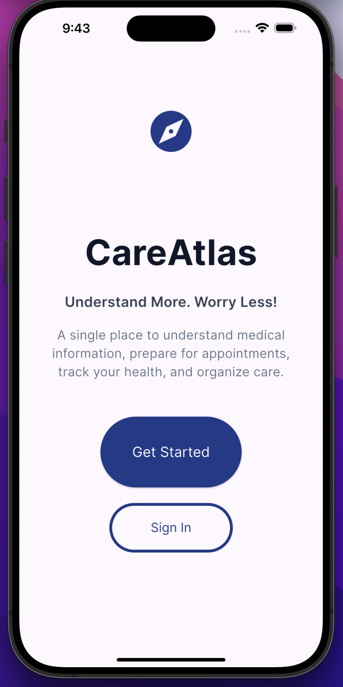
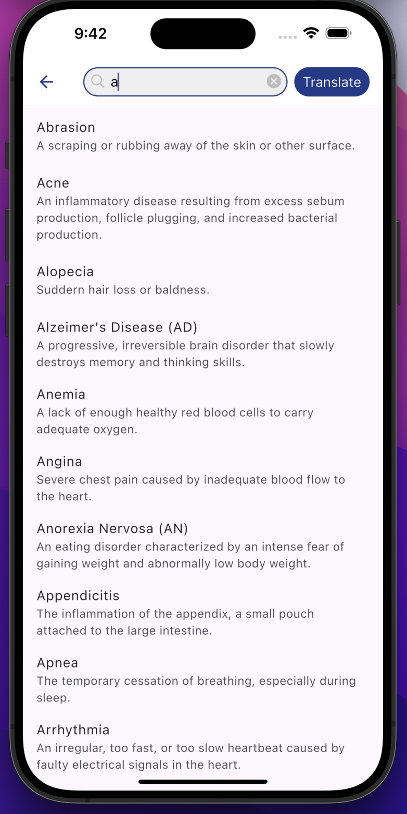

# CareAtlas

CareAtlas is a Flutter mobile application designed to help patients better understand and manage their healthcare. The app simplifies complex medical information, helps users prepare for appointments, and provides tools to organize important health records in one place.

## Motivation

Healthcare information can often be overwhelming, especially when patients are faced with unfamiliar medical terminology, lab results, and treatment plans. CareAtlas aims to improve health literacy by making medical information easier to understand and helping patients become more informed participants in their own care.

## Features

### Medical Term Translator
- Search common medical terms and diagnoses
- View plain-language definitions
- Learn about symptoms, treatments, and related information

### Question Builder
- Create and save questions before doctor appointments
- Organize concerns by appointment or topic

### Appointment Notes
- Record physician recommendations
- Save important follow-up instructions
- Keep all appointment notes organized

### Treatment Timeline
- Track diagnoses, treatments, procedures, and important milestones
- View medical history in chronological order

### Lab Results Visualizer *(In Progress)*
- Display laboratory values in an easy-to-read format
- Help users better understand common laboratory tests

### AI Medical Explanation *(Planned)*
- Generate simplified explanations for medical information
- Provide patient-friendly descriptions of complex healthcare concepts

## Technologies Used

- Flutter
- Dart
- Material Design

## Project Status

🚧 Active Development

Current focus includes expanding the medical terminology database, improving the search experience, implementing lab result visualizations, and integrating AI-powered medical explanations.

## Future Goals

- Expand the medical term database
- Add secure cloud synchronization
- Improve accessibility features
- Support multiple languages
- Integrate AI-assisted health education
- Enhance lab result interpretation

## Screenshots

## Screenshots

### Home Screen

### Medical Translator

## Author

Developed by Vani as a project to improve patient understanding of healthcare information through accessible technology.
